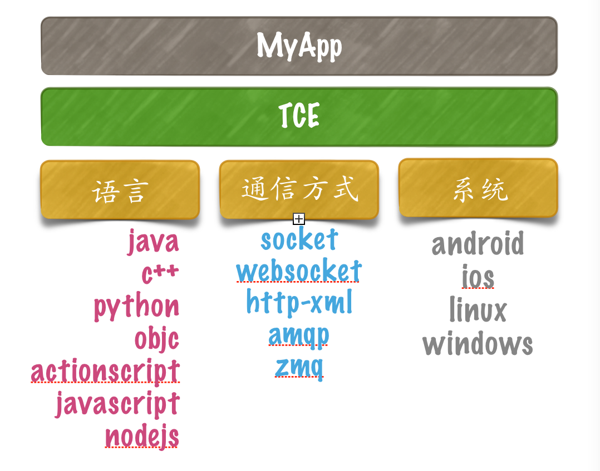
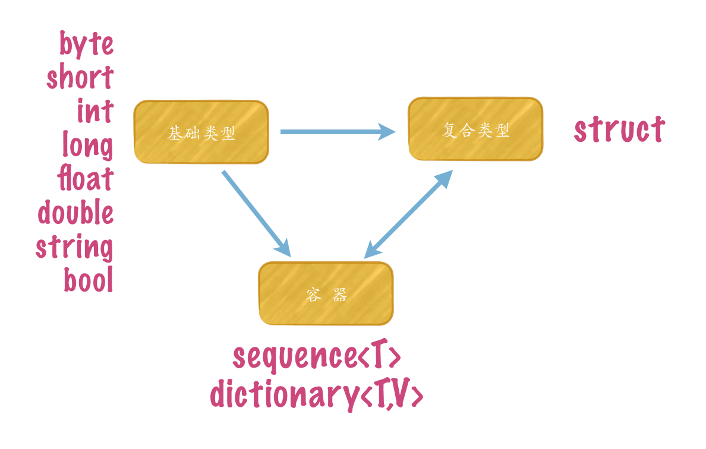
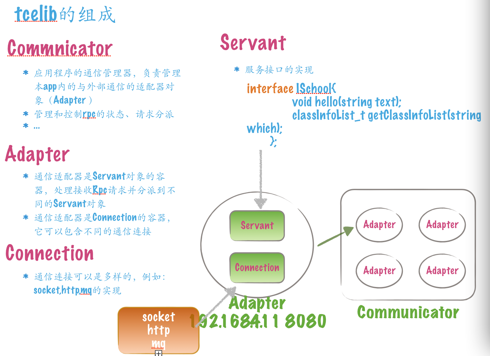
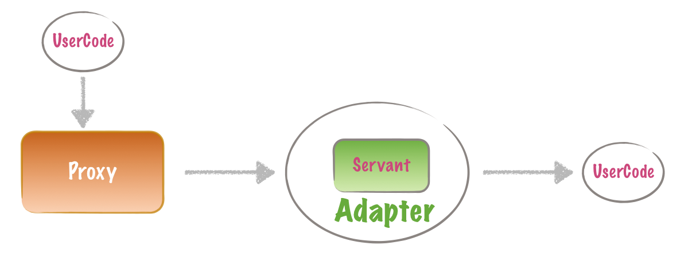

# Tce
 author: `adoggie`  13916624477  sockref@hotmail.com 
 
 2015.7.6

## 1.1 背景
 互联网技术飞速发展，各种internet应用服务满天飞，每天都有新的idea层出不绝。互联网应用推成出新的速度非常的快，业务和技术快速更新和迭代，传统的开发模式和技术不能满足互联网模式的要求。

很久以前，要驱动一个项目的设计、开发和实施，要求和成本还是比较的高。开发者必须熟练一到二门开发语言之外，还必须了解多种数据库，通信架构，交互模式等。c/c++/delphi/vb时代基本都是c/s的技术模式，但随着互联网时代、大数据时代、移动社交时代的到来，传统开发技术已慢慢被淘汰，各种开发技术涌现对开发者要求越来越低，能完成业务目标，技术不再是硬门槛。 

曾几何时，基于http的webservice大行其道，各种技术手段和业务模式都往http靠拢，网络提速、硬件性能的提升，令http性能问题不再显得扎眼，俨然，http已成为工业标准 。 

对于一个js开发者来讲，前台到后台贯串整个业务实现流水线完全由一人完成，这是多么令人振奋，老板定是喜欢。
现在的大系统，上了规模，那必定是 集群化、分布式、网络异构和技术异构的，一种技术定乾坤肯定是不合理。 

 

## 1.2 Tce是什么？
tce 的目标是提供一套易用的、一致编程接口标准的通信库。

使开发者只需将关注点放在应用业务代码上，而不用关心数据如何被传递、交互和处理，避免了开发者重复开发通信程序的成本。 

使用tce可快速构建移动互联网系统，在移动端建立与平台系统的桥梁，提供平台系统之间数据交换通道，并解决大规模移动终端接入、集群消息分派和调度、消息反向推送等问题，为社交系统、即时通信系统提供基础支撑。 

使用tce能很方便的架构系统集群，为大数据，大并发做好准备，省去了大量的繁琐的非业务相关的技术工作。

tce提供的服务都是基于接口的服务，开发者只需定义业务接口，采用自己熟悉的开发工具实现业务功能。开发人员只需如同调用本地函数方式调用不同的业务服务功能，这些服务可以是本地的、远程的、分布式或集群的，且都是被接口化定义和隔离。 
 
`http是标准也很普及，但是我觉得还不够`

对开发者而言，对其有真正有帮助的是让业务与技术实现分开。虽然http够标准，使用也不是问题，但还是需要开发者过多的介入，比如要处理POST、GET请求，数据封包是urlencoded、xml或json.所以tce在html5的应用场景下对websocket进行了rpc的实现，网页应用可以以简单接口方式的使用平台服务功能，且这些传输是二进制的，所以是高效的、安全的，为html5的实时应用提供了保证。


#### RPC技术
rpc 是sun公司提出的技术，其内容是XDR一种实现. RPC的技术实现有很多，例如 : rmi、AJP, corba,visibroker,dcom,zeroc,xmlrpc,soap等等 。


soap是基于xml的rpc技术，通过wsdl等方式定义基于webservice的接口，soap可以是http或者tcp的，应用全体很广泛，扩展性也很强，出现了很多对soap的支持。例如： gsoap就是c++的soap服务实现，使用者定义wsdl之后，生成调用框架代码，实现客户与服务的接口函数级的调用。 

以上诸多的技术均可实现rpc服务，并且其各有特点和限制。例如 corba是工业级标准，但其过于复杂和庞大，不够灵活，学习成本高； dcom 是微软体系的rpc技术，当然只能在ms范围内使用。基于文本的xml/soap虽然扩展性强，但数据量大是个问题。

开发tce是在学习zeroc代码之后产生的想法，原因在于 zeroc的rpc里面有很多我认为是比较累赘的东西，本想将其瘦身，后来发现代码关联太紧，花时间去改造还不如自己实习一套。

我需要的rpc应该是轻量级的、灵活的、易扩展的，与开发技术、网络、平台、通信协议、应用无关。 rpc应提供简易的编程接口，简化网络编程的工作，避免重复造轮子的过程。 


#### 实现RPC有哪些内容： 
1. 接口定义 
2. 数据序列化和反序列化 
3. 通信传输
4. 消息分派 
5. 调用模型 

#### tce有哪些特点 



##### 1. 多语言支持 

支持的程序语言包括:
  
 1. `c++ `( stl/boost/asio) *
 2. actionscript 
 3. `java`   *
 4. `python` (gevent/libev/websocket) *
 5. javascript 
 6. php
 7. object-c
 8. node-js
  
##### 2. 系统平台 
 
 1. android
 2. ios
 3. html5 
 4. windows/linux (c++/java supported)
  
##### 3. 网络通信

 1. socket （tcp）
 2. mq 		(qpid,zeromq,easymq)
 3. websocket  (http)


# 2. 走进TCE
## 2.1 第一个程序 echo

开始我们第一个程序 server, 其功能很简单，仅仅提供一个echo方法，服务程序接收调用者发送的消息，并将其打印，并将消息回显到调用端。

使用tce实现只需几个步骤： 

1. 编写idl  `test.idl`
2. 生成代码存根 skeleton   `test.py`
3. 编写服务代码 `server.py`
4. 编写客户代码  `client.py`
5. rocking&roll


编写接口 test.idl :

```	
	module test{
	
		interface Server{
			string echo(string greeting);
		};
	}

```	


编译idl ,产生 test.py文件   

```
	tce2py -i test.idl -o ./	
```


编写服务程序  server.py 

```
	import os,time,traceback
	import tcelib as tce 
	from test import Server 
	
	class ServerImpl(Server):
		def __init__(self):
			Server.__init__(self)
			
		def echo(self,greetings,ctx):
			return greetings
			
	
	def main():
		tce.RpcCommunicator.instance().init('server')
		ep = tce.RpcEndPoint(host='',port=16005)
		adapter = tce.RpcCommunicator.instance().createAdapter('first_server',ep)
		servant = ServerImpl()
		adapter.addServant(servant)
		tce.RpcCommunicator.instance().waitForShutdown()
		
	if __name__ == '__main__':
		sys.exec(main())
```

编写客户端程序 client.py: 

```
	import os,time,traceback
	import tcelib as tce 
	from test import ServerPrx 
	
	
	tce.RpcCommunicator.instance().init()
	
	ep = tce.RpcEndPoint(host='localhost',port=16005)
	prx = ServerPrx.create(ep)
	
	print prx.echo('hello')


```


### Proxy 和 ServantBase

tce为idl中的interface自动生成框架代码，其包含两部分内容： Proxy and ServantBase。 

Proxy包装客户端访问远程服务的功能，tce根据idl定义自动生成Proxy对象，客户端程序调用Proxy的功能接口就可完成与远端服务的交互。 

ServantBase 是指服务接口的定义，在这里我们将每个interface的实现称之为servant对象。tce自动生成这些servant对象的定义，要实现server端的功能，只需从这些ServantBase派生，并实现其关心的接口即可。 


```
	test.idl 
	
	interface Server{
		string echo(string text);
	};

	tce2py.idl 生成skeleton test.py
	
	class ServerPrx:
		def echo(self,text,extra={}):
			pass
			
		def echo_oneway(self,text,extra={}):
			pass
			
		def echo_async(self,text,asyc_back,extra={}):
			pass
			
		....
		
		
	class Server:
		def echo(self,text,ctx):
			return ''
			
	
```

tce2py.py 自动生成了Server定义的Proxy对象(ServerPrx)和ServantBase对象(Server)


## 2.2 接口定义IDL 

接口是指不同业务系统之间对业务功能的一种外部呈现，接口的功能是业务提供方实现，并由使用方调用。 

### 1. 关键字 

id | name | comment
---|------| -------
1 | import | 导入其他idl模块
2 | module | 表示一个模块定义，可理解为定义namespace
3 | interface | 服务接口定义
4 | extends | 接口继承
5 | struct |  复合数据集合
6 | sequence | 数组类型
7 | dictionary | 字典类型
8 | byte,short,int,long,float,double,string,bool | 基础数据类型


### 2. 编写 idl

idl文件可以用任何文字编辑工具生成。


```
	idl定义基本样式 
	
	import otheridl
	module{
		sequence<> seq;
		dictionary<> dict;
		struct {} ;
		interface server extends baseserver{
			void hello();
		};
	}
```

使用 `import` 可以导入多个外部的idl

一个idl文件中可以包含多个module定义，module不支持嵌套, `{}`之后没有`;` , 但内部定义元素之间必须以`;`分隔。


## 2.3 数据类型 

编写idl时，采用tce的数据类型，通过简单的数据类型可以组装成复杂的数据对象。 



### 1. 基础类型 

NO | name | size | c++ | python | java | as | object-c
---|------|-------| ----|--------|-------|----|----------
1  | byte  | 1    | uint8_t |      |  byte | 	|uint8 
2  | short | 2    | int16_t|        |short |     | short 
3  | int   | 4     |int32_t|       | int   |     | int32_t
4   | long | 8    | long |        | long   |     |long 
5  | float| 4     | float |       |float|       |float
6 | double | 8    | double |      |double|      |double
7 | string | n+4   | std::string|string|String|  |NSString
8 |bool    | 1     | bool  | True/False|boolean | |NSBoolean


### 2. 复合类型 struct

idl | c++ | python | java | as | object-c
---|------|-------| ----|--------|-------
struct | struct | class | class | | interface 


 struct 提供了属性集对象的功能。从oo的角度来看，任何对象都可以是一个结构类型的定义 。 
 
 
 ```
 struct Cat {
 	string  skin; 
 	int		age;
 	int 	categary;
	...
 }；
 ```

 
 
### 3. 容器类型  sequence / dictionary 

idl | c++ | python | java | as | object-c
---|------|-------| ----|--------|-------
sequence | std::vector|list|Vector|Array | NSArray
dictionary | std::map |dict|HashMap|HashMap| NSDictionary

	

##### 3.1 数组
关键字: `sequence<T>`

sequence表示数组，其应该是线性的。 `T`可以是简单数据类型、容器类型、结构类型。 

```
	sequence<string> string_list;
	sequence<int> 	int_list;
	sequence<string_list> tables; 
	
	更多
	struct Pet{ ... };
	sequence<Pet> PetList;
	dictionary<string,Pet> PetsNamed;
	
	sequence<PetsNames> PetsNamedList; 
	
```
 
##### 3.2 字典
 关键字: `dictionary<K,V>`
 
 dictionary 是字典结构（hash），`K` 必须是简单数据类型，不能是复合对象; `V`可以是简单数据类型、容器类型、结构类型。 

 
 
### 4. 字节数组特殊处理  

idl | c++ | python | java | as | object-c
---|------|-------| ----|--------|-------
sequence<byte> | std::vector< byte >|str|byte[]|byte[] | NSData

### 5. 复合数据组装 
有了基础数据类型、struct、容器之后，我们可以面对复杂的对象进行包装了。
struct、sequence、dictionary支持定义嵌套，例如:

```
 struct Pet {
 	string	name;
 	string  skin; 
 	int		age;
 	int 	categary;
	...
 }；
 
 sequence<Pet> PetList;
 
 struct Family{
 	string name;
 	PetList pets;	 //宠物列表
 };
	
```

### 6. 行注释

tce的idl文件支持两种行注释 // 或者 # 


## 2.4  接口 interface
关键字： `interface`


## 2.5 调用模式 

tce为不同调用模式自动生成不同的代理接口


test.idl 定义  

```
	
module test{

interface BaseServer{
	string datetime();
};

interface ITerminalGatewayServer{
	void ping();
};


interface Server extends BaseServer{
	string echo(string text);
	void  timeout(int secs);
	void heartbeat(string hello);
	void bidirection();
};


interface ITerminal{
    void onMessage(string  message);
};

}
			
```

### 1.two-way
	
阻塞式同步调用，调用发起并等待返回。 这种调用方式常见与c/s交互场景，阻塞调用对client来说是最易于理解和使用的模式，发起功能调用直到到服务处理返回或者异常产生，期间调用者会一直保持阻塞，直到超时产生。

```
python版本的tce实现采用gevent，底部是libev，提供单线程的io异步复用的协程运行模式，免去了多线程的资源开销和内核调用工作，使gevent的效率比多线程实现更高，由于是单线程模式，基本免去了
很多互斥、同步等问题，降低了编程复杂度，提高了性能。
```

tce的调用模式有同步和异步之分，但内部实现均是io异步处理。

异常类型： 
	
1. 发送失败
2. 数据类型错
3. 服务端错误

```
客户程序 client.py

	def call_twoway():
		print prx.echo("hello",timeout=0,extra={'date':'1926-12-12'})
```

	
### 2. one-way
	
oneway调用应用在单向呼叫，并无需返回等待的场景，表示业务功能接口没有返回，oneway的接口函数类型必须是 `void` 类型.

tce 为 void 接口函数自动生成 以 `_oneway`后缀的函数名

```
def call_oneway():
	prx.heartbeat_oneway('hello world!',extra={})
```


	
	
### 3. async-call
async调用在用户发起请求之后，通过回调函数来接收返回值。

```
def call_async():

	def hello_callback_async(result,proxy,cookie):#回调接口
		print 'async call result:',result
		print 'cookie:',cookie

	prx.echo_async('pingpang',hello_callback_async,cookie='cookie',extra={})
```


### 4. timeout-call
timeout-call提供阻塞调用等待超时的功能，同步调用方式是最容易理解和操作的方式，用户可以指定期待处理的等待时间，在调用发起后等待返回，直到超时发生。 

```
def call_timeout():
	try:
		print prx.timeout(3,6,extra={})
	except tce.RpcException, e:
		print e.what()
```

### 5. bidirection

在互联网应用环境中，客户机往往都是安置在NAT之后，服务器与客户机通信必须由客户机发起对服务器的连接，常规的rpc服务往往都是单向的，连接发起者是服务的消费者，被连接者是服务的提供者，所以在互联网环境中，客户机可以使用rpc方式调用服务器上的服务，但服务器作为服务提供者却不能直接访问客户机上的服务。

bidirection提供的客户端连接复用方式解决了服务器调用客户机上接口的功能.

```
client.py 

class TerminalImpl(ITerminal):
	def __init__(self):
		ITerminal.__init__(self)

	def onMessage(self,message,ctx):
		print 'onMessage:',message
		
def call_bidirection():
	adapter = tce.RpcCommAdapter('adapter')
	impl = TerminalImpl()
	adapter.addConnection(prx.conn)
	adapter.addServant(impl)
	tce.RpcCommunicator.instance().addAdapter(adapter)

	prx.bidirection_oneway()
	
--------------------------------------------
server.py

	def bidirection(self,ctx):
		"""
		not supported in message-queue scene.
		birection适用在 链路双向复用的场景 ,例如: socket
		:return:
		"""
		self.clientprx = ITerminalPrx(ctx.conn)
		self.clientprx.onMessage_oneway('server push message!')

```


## 2.5 内部结构  

几个重要部件： 

1. Communicator
2. Adapter
3. Servant
4. Proxy
5. Connection

他们是tce核心功能部件，这些部件在不同的开发语言中都有相同的实现。 




### 1. Communicator 通信器 
它是应用application的全局服务对象，也是个单例对象。communicator是tce运行的容器，提供多种功能： 

1. 初始和配置 
2. 本地服务对象管理 
3. 通信管理 
4. 消息分派

###2. Adapter 
adapter是服务实现的容器，并且adapter有是通信连接的容器 


###4. Proxy 
* 列集了服务功能接口，是访问interface的客户端设施
* 使用proxy等同调用本地函数
* 由tce根据idl定义自动产生
* 完成通信和消息序列化工作
* 多种调用模式： 阻塞、异步、单向、超时


### websocket支持


### 外带数据控制 OOB
每个代理对象内的接口函数最后一个参数extra就是OOB，extra类型是dictionary,携带的OOB参数必须是 KEY:VALUE类型，且必须是字符串类型。
 
1. c++ :    map<string,string> 
2. java:    HashMap<string,string>
3. python:  {}
4. javascript: object 
5. objc: NSDictionary

python代码: 

```
	server:
	
	class ServerImpl(Server):
		def __init__(self):
			Server.__init__(self)
			
		def echo(self,greetings,ctx):
			print 'extra OOB data:',ctx.msg.extra.props
			return greetings
			
	
```

```
	
	client:

	tce.RpcCommunicator.instance().init()	
	ep = tce.RpcEndPoint(host='localhost',port=16005)
	prx = ServerPrx.create(ep)
	print prx.echo('hello',{'first':1,'second':2})

```


# 3. 应用场景 

# 4. 移动互联网平台架构
